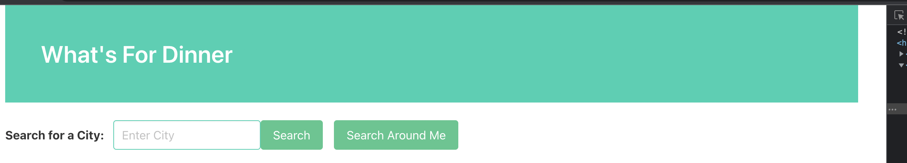
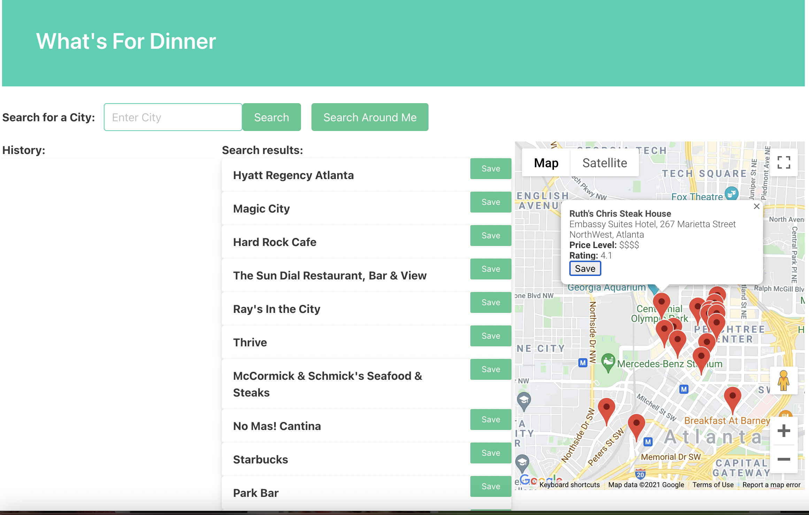
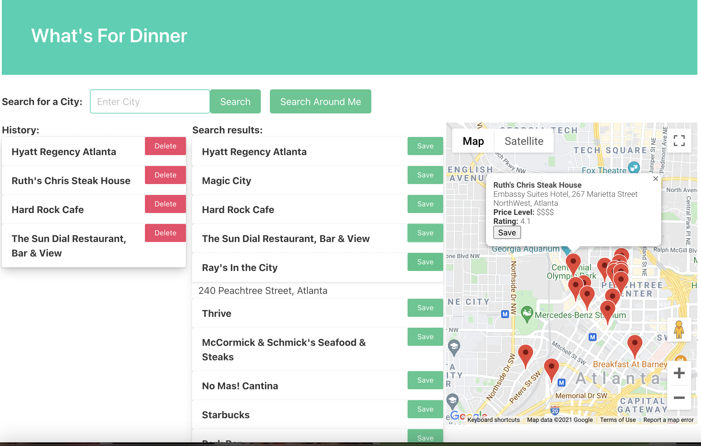

Whats_for_dinner is an application to navigate you to resturants wherever you would like.

A user inputs the city in the "enter city" box and clicks on "search".

A map/ satellite view is generated and the various location pin pointed on the map.
On the map view, the user is able to click on a pin which would display the name, address, price level and the rating.
The user is able to save the location to the history list on the left by clicking on the save botton.

A list is generated in the middle section of the page. A user is able to hover ove the name to display the address of the resturant 
The User is able to save the option by clickiong on the save button on the right of the listing.
All saved choices are listed out in the history column on the left.

The user is able to delete from the list by clicking the delete button in the contained box.

For this project the following API's were used 
Weather API- GPS coordinates
Google cloud places API
Maps Javascript API
